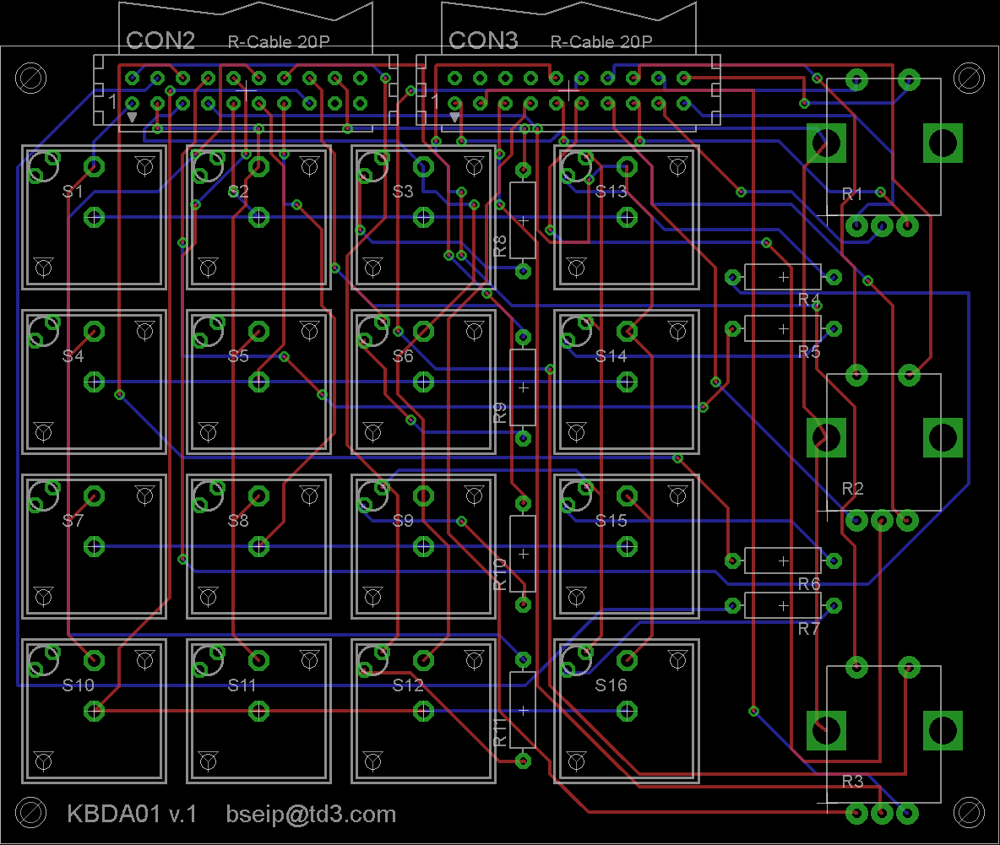

###Keyboard01

Passive 4x4 matrix keyboard with Marquardt switches and three rotary encoders

Made with CadSoft Eagle

###Image

[Schematic](Images/keyboard01.sch.png)

###License

[BSD](LICENSE-BSD.txt) for software

[Creative Commons 4.0](LICENSE-CC.txt) for pcb and other artwork

###Copyright

Copyright (c) 2016 Bjoern Seip

